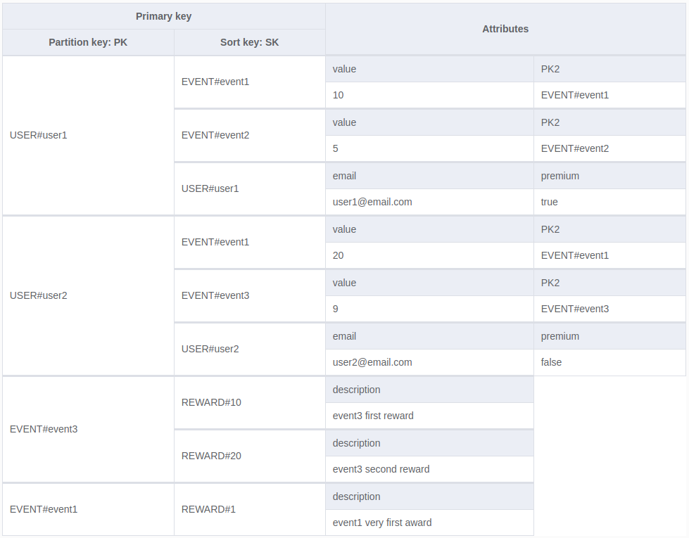

Event streaming system for rewards based on user statistics.

Events are ingested through Kinesis Data Streams. A Lambda consumer updates user data in a DynamoDB table.

A Lambda watches changes on the DynamoDB table stream and publishes rewards to and SQS Queue if criteria are met.

Single table design for DynamoDB.

Contains user event information as well as rewards for event types.

